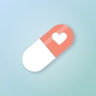
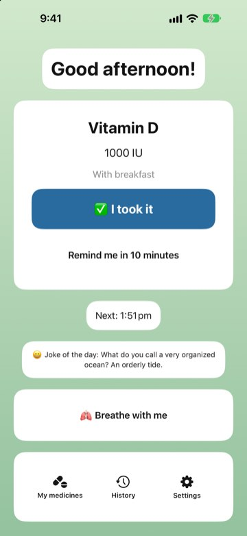
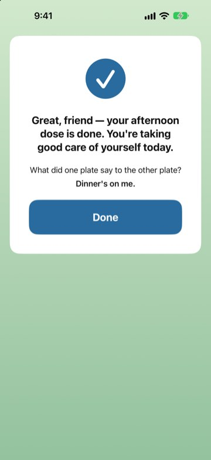
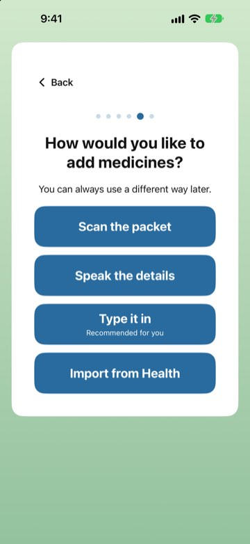
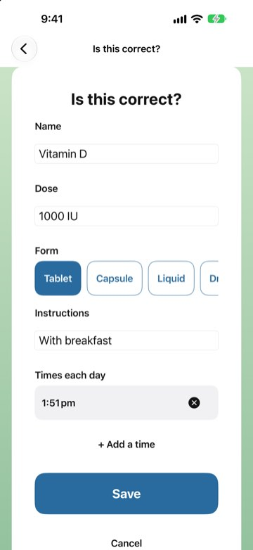
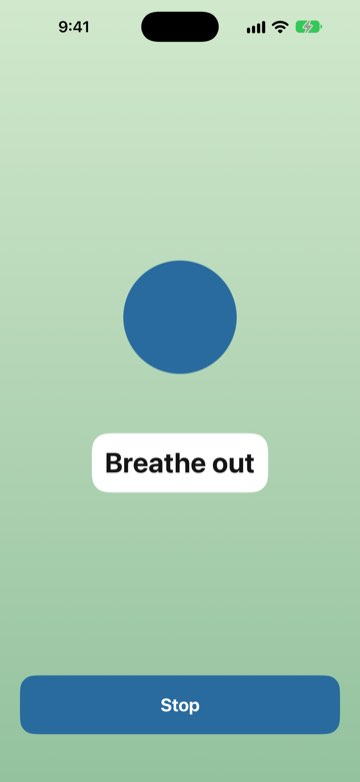
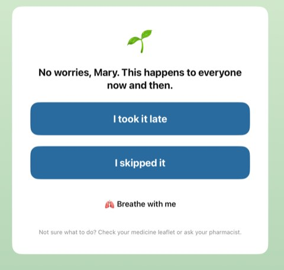

<p align="center">
  
</p>

<h1 align="center">KindDose</h1>

<p align="center"><b>Gentle medicine reminders, designed elder-first for everyone.</b><br>
Logging a dose takes seconds and feels good: one big button, a kind word and a joke afterwards, and no guilt when a dose is missed.</p>

<p align="center">
  
  
  
  
</p>

<p align="center">
  🌐 <a href="https://shruezee.github.io/KindDose/">Website</a> · 🔒 <a href="https://shruezee.github.io/KindDose/privacy.html">Privacy policy</a> · 🧪 Status: submitted to the App Store (in review)
</p>

<p align="center">
  
  
  
</p>

## Why

Many medicine apps have small text, dense lists, and red warnings that make missing a dose feel like failing. Older adults often take several medicines a day, and an app that adds stress gets abandoned. KindDose is built for them first, which makes it easier for everyone.

## Design principles

- **Under 5 seconds to log a dose.** The home screen shows only the next medicine and one large "I took it" button. You can also log straight from the notification.
- **Elder-first and accessible.** Text scales to the largest accessibility sizes, every control works with VoiceOver, Voice Control and Switch Control, tap targets are 60pt or more, and colour is never the only signal.
- **Kind, never guilt.** No red crosses or broken streaks. A missed dose gets reassurance, options to record it, and a one-minute breathing exercise.
- **Safe by design.** Scanned or spoken medicines always go through an "Is this correct?" screen, and the app never gives medical advice.
- **Private.** No accounts, ads, analytics, or network calls. Everything stays on the device.

<p align="center">
  
  
  
</p>

## Features

- Adaptive first-launch setup: name, text size, VoiceOver detection, "for me" or "for someone I care for"
- Four ways to add a medicine: **scan** a label or handwritten list, **speak** it, **type** it, or **import** it from Apple Health
- Time-sensitive reminders with "I took it" and "Remind me in 10 minutes" actions and gentle follow-ups
- Optional alarm-style reminders that ring in Silent mode (AlarmKit, iOS 26+)
- A validation message and an all-ages joke after every dose; reassurance and breathing after a missed one
- Kind history with soft streaks ("5 days in a row 🌱")
- Home Screen and Lock Screen widgets with an interactive "I took it" button
- Siri and Shortcuts: "I took my medicine in KindDose", "What's my next medicine in KindDose?"
- Calm time-of-day backgrounds that respect Reduce Motion, Increase Contrast and Reduce Transparency

## Engineering highlights

| Area | How it's built |
|---|---|
| UI | SwiftUI, small focused views, one feature per folder |
| Persistence | SwiftData, in a shared **App Group** container so the app and widget read the same data; resets safely if a migration fails |
| Reminders | `UserNotifications` with actionable categories and an escalation schedule; respects the 64 pending-notification limit; a missed-dose sweep runs on foreground and on notification delivery |
| Alarms | **AlarmKit** behind `if #available`, with a notification fallback on iOS 17–25 |
| Scanning | **VisionKit** `DataScannerViewController`, falling back to Vision text recognition on a captured photo, all on-device |
| Voice | **Speech** framework with on-device recognition where supported |
| Health | **HealthKit** read-only import of the user's medications; never writes |
| Widgets & Siri | **WidgetKit** + **App Intents** (interactive widget button and App Shortcuts) |
| Testing | **Swift Testing** with in-memory SwiftData containers |
| Privacy | `PrivacyInfo.xcprivacy` declaring no tracking and no collected data |

### Project structure

```
KindDose/
├── Onboarding/      Adaptive first-launch flow
├── Home/            Next-dose card, "I took it", taken moment, dose resolver
├── AddMedicine/     Scan, speak, type, Health import, "Is this correct?" screen
├── Notifications/   Reminder scheduling, escalation, AlarmKit, missed-dose sweep
├── Missed/          Missed-dose reassurance
├── Breathing/       "Breathe with me" exercise with haptics
├── History/         Weekly history and kind streaks
├── Intents/         App Intents and Siri shortcuts
├── Content/         Validation messages and jokes (bundled JSON)
├── Models/          SwiftData models: Medicine, DoseLog, UserSettings
├── MyMedicines/     Medicine list, edit and delete
├── Settings/        Text size, jokes, alarm sound, safety and privacy info
├── Shared/          App Group container
└── Theme/           Calm backgrounds, cards, big buttons
KindDoseWidget/      Widgets and the interactive "I took it" intent
KindDoseTests/       Swift Testing unit tests
AppStore/            Listing text and App Store screenshots
project.md           The product and accessibility rules the app was built against
```

## Running it

1. Open `KindDose.xcodeproj` in Xcode 26 or later.
2. Select your own team under **Signing & Capabilities** for the app and widget targets (they use HealthKit, App Groups, and Time-Sensitive Notifications).
3. Run on an iPhone or iPad simulator (iOS 17+). Run the tests with **⌘U**.

## About

Designed and built by **[Shruthi](https://github.com/shruezee)**, an iOS developer in Sydney. KindDose is a reminder tool, not medical advice.

© 2026 ShruthiRamKum
